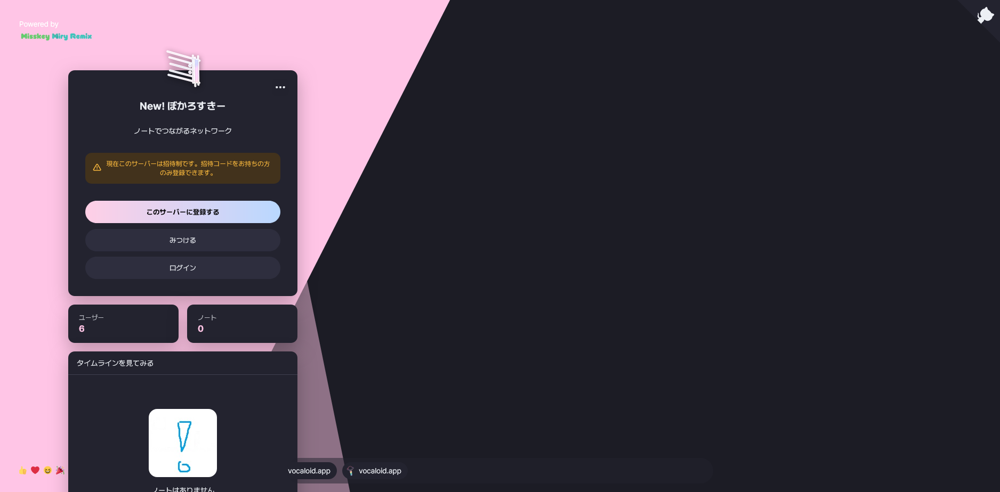
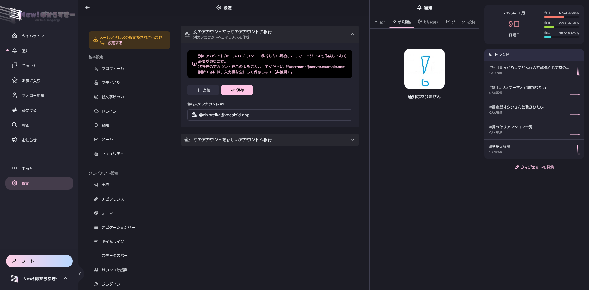
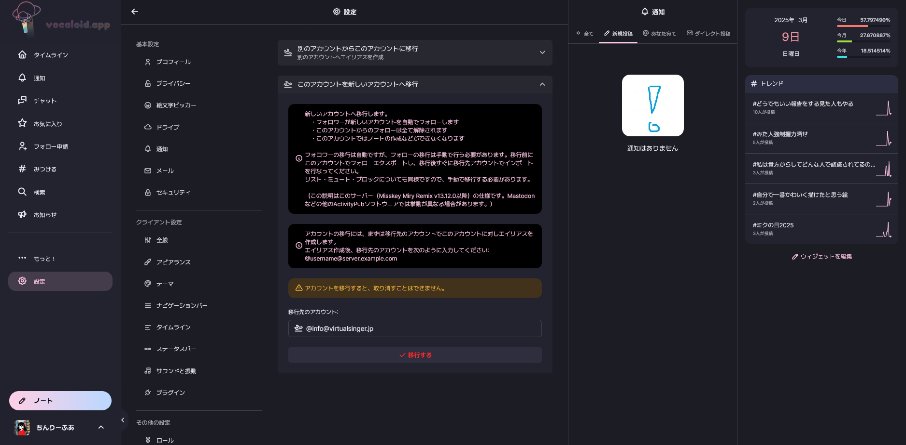
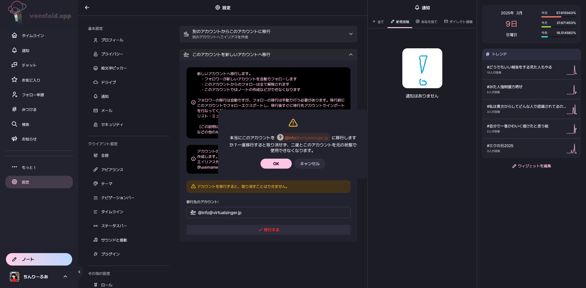
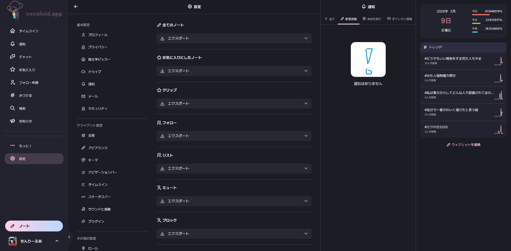
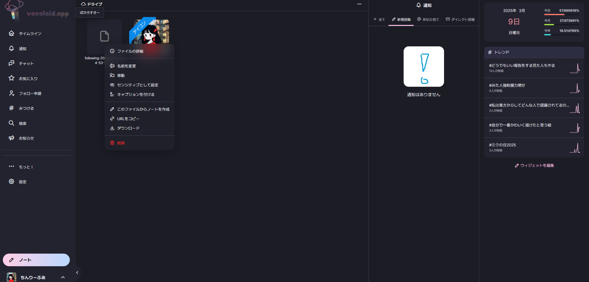
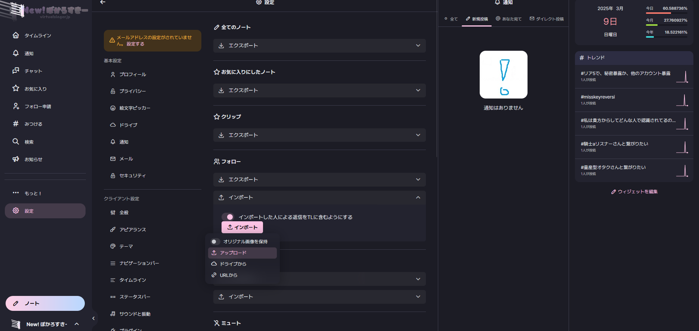

### このマニュアルについて

このマニュアルは、virtualsinger.jpの設立と同時に作成されました。例としてvocaloid.appからvirtualsinger.jpへの移行を示していますが、他のインスタンスでも応用可能です。

注意: インスタンス＝サーバー

### 新しいインスタンスに登録する

まず、移行先の新しいインスタンスに登録してください。移行先のインスタンスは利用規約が違いますので、登録前に必ず確認してください。

### 移行元アカウントを指定する

移行先アカウントの基本的な操作が完了したら、設定→アカウントの移行を開いてください。
そして、下記写真のように移行元アカウントのIDを入力して下さい。

### 移行する

ここで、移行元インスタンスに戻ります。移行作業を開始できますが、一度移行してしまうとそのアカウントは<strong>二度と</strong>使用することができなくなります。それを了承の上、これ以下の移行作業を行ってください。

まず、先ほどと同じ設定→アカウントの移行を開いてください。
そこにある「このアカウントを新しいアカウントへ移行」を開きます。
同じく下記画像のように入力して「移行する」を押すと移行することができます。

この後確認ボタンが出てくるので、それに了承してください。もし移行したくなくなったら、ここでキャンセルして下さい。これが最後のチャンスです。

あとはもう簡単です。移行元のインスタンスでいろいろ移行したいものをエクスポートしてください。(フォローやブロックなど)
ノートはエクスポートはできますが、インポートはできないので注意。

エクスポートを押し終えたら、ドライブを開いてそこにできた.csvファイルを片っ端からダウンロードしてください。

ここまでが移行元インスタンスでの作業です。お疲れ様でした。

ここから久しぶりに移行先インスタンスに行きます。

まず、設定→インポートとエㇰスポートを開いてください。

それで、先程エクスポートした項目と合うファイルをインポートして下さい。(例:フォロー→following-～.csv)

これで、インポートするファイルを間違えると大変なことになるのでよく見てインポートしてください。

はい、これにてすべて終了です。お疲れ様でした。

わからない点があれば、このドキュメントの作成者 [lily.hkmilktea@etnfed.ru](mailto:lily.hkmilktea@etnfed.ru) にご連絡ください。